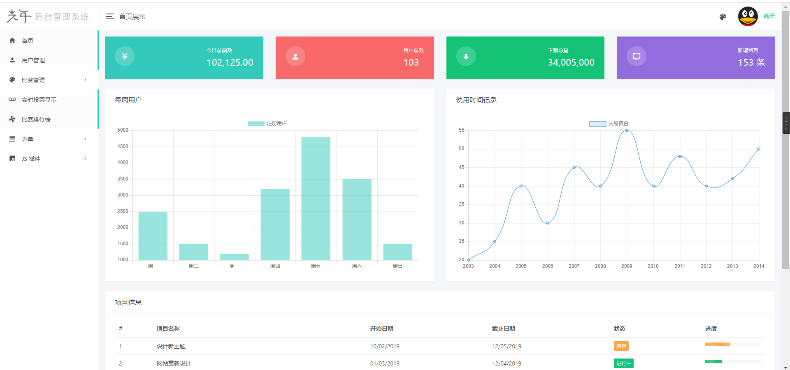
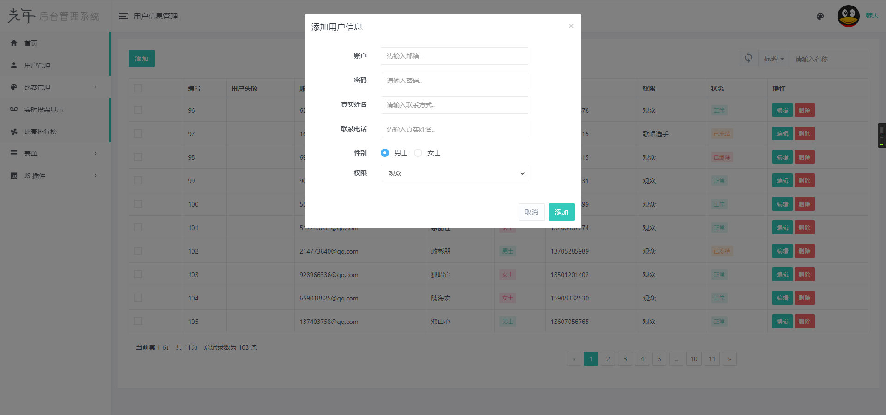
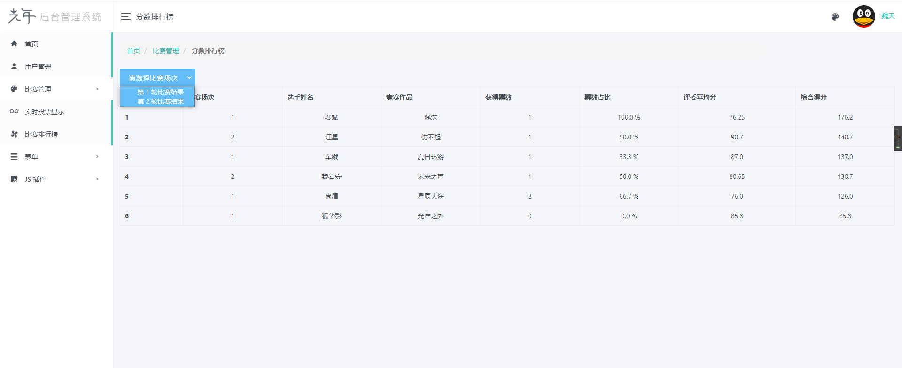
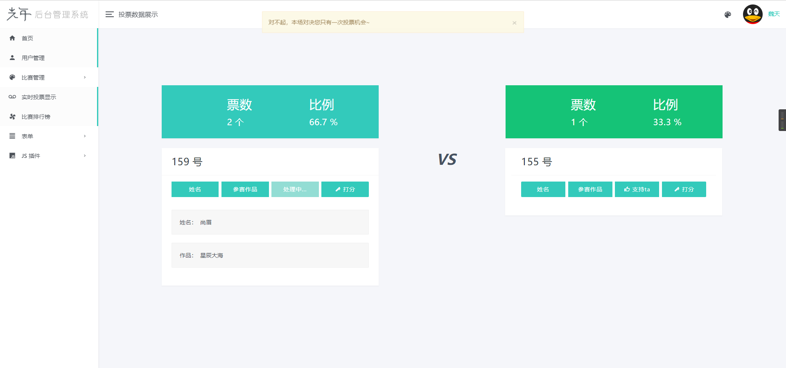
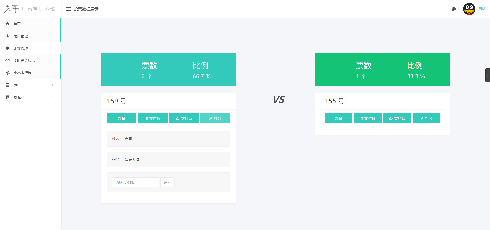
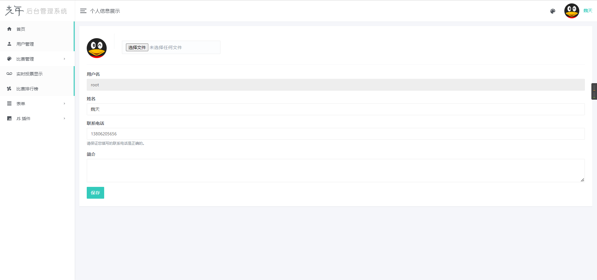
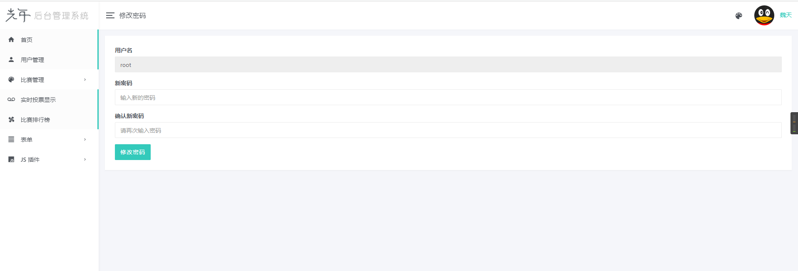

# 工程简介

### 使用技术：SpringBoot + SpringSecurity + Thymeleaf + Bootstrap + Mybatis/MybatisPlus。

# 延伸阅读

# 登录界面

# 注册界面

# 主界面

# 用户管理界面

# 对战匹配界面

# 比赛分数排行榜界面

# 观众投票界面

# 评委打分界面

# 个人信息展示界面

# 修改密码界面

